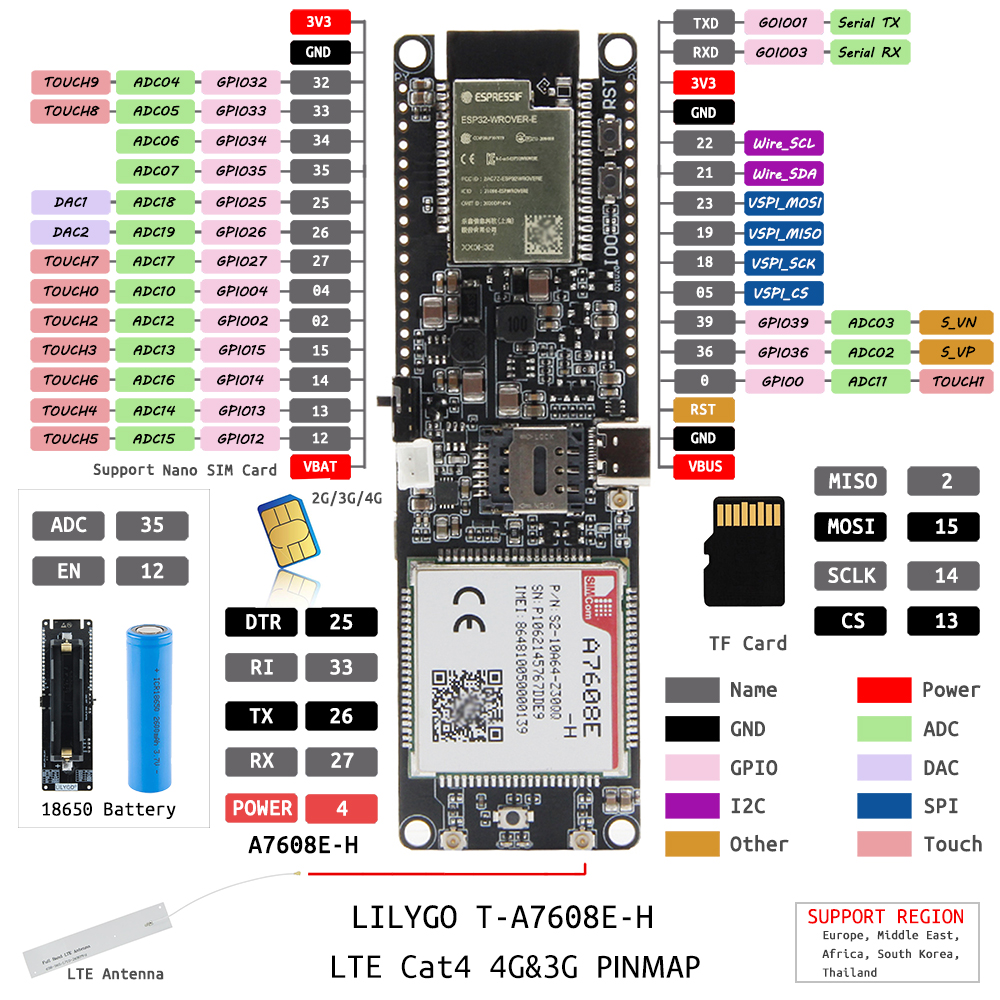
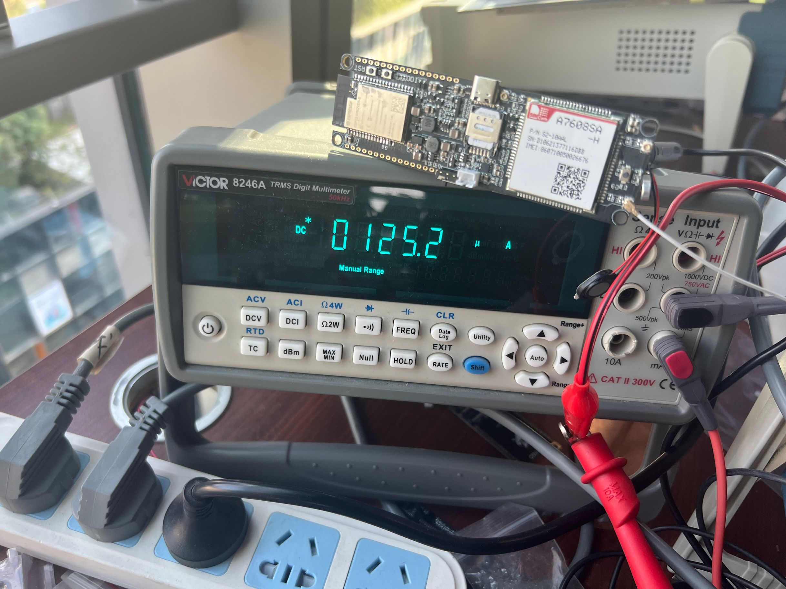

<h1 align = "center">🌟LilyGo T-A7608X🌟</h1>

## **English | [中文](docs/docs_cn.md)**

<h3 align = "left">Quick start:</h3>

## USE Arduino IDE

1. Install the current upstream Arduino IDE at the 1.8 level or later. The current version is at the [Arduino website](http://www.arduino.cc/en/main/software).
2. Start Arduino and open Preferences window. In additional board manager add url: https://raw.githubusercontent.com/espressif/arduino-esp32/gh-pages/package_esp32_index.json .separating them with commas.
3. Select Tools -> Board Management -> Search for ESP32 and install
4. Select Tools -> Board -> ESP32 Wrover Modelu Module
5. Need to install the following dependencies (Unzip and copy to the '~Arduino/libraries' directory)

   - [TinyGSM](https://github.com/vshymanskyy/TinyGSM)
   - [StreamDebugger](https://github.com/vshymanskyy/StreamDebugger)
   - [ArduinoHttpClient](https://github.com/ricemices/ArduinoHttpClient)

## USE PlatformIO

1. Install[VSCODE](https://code.visualstudio.com/)and[Python](https://www.python.org/)
2. Search for the PlatformIO plug-in in the VSCODE extension and install it.
3. After the installation is complete and the reload is completed, there will be a small house icon in the lower left corner. Click to display the Platformio IDE home page
4. Go to file - > Open folder - > Select the LilyGO-T-A7608X  folder and click the (√) symbol in the lower left corner to compile (→) for upload.

<h2 align = "left">Product 📷:</h2>

| Product  |                            Product  Link                            |
| :------: | :-----------------------------------------------------------------: |
| T-A7608X | [AliExpress](https://www.aliexpress.com/item/1005004093420651.html) |

## Notes for new Users

1. pin VIN is a USB input, if a battery is being used to power the device there will be no voltage output from VIN meaning 3.3v is the only power output.

2. When using the built-in battery pack the on/off switch will function as normal, supplying/cutting off power to the board, However, if an external battery pack is used and attached to the VBAT pin the on/off switch will be bypassed meaning the only way to shut off will be to disconnect the batteries.

3. On/off switch is for battery use only, it will not function when plugged into USB.

4. Battery voltage can not be read when plugged into USB using the onboard BAT ADC(35) 

5. Recommended solar panels are 4.4v to 6v **DO NOT EXCEED OR BOARD MAY BE DAMAGED** 

6. When an SD card in you can not upload software in Arduino IDE since the SD card uses IO2 as CS, the SD card must be removed when uploading a new sketch. 

## Battery life
Current consumption from 3.7 Volt battery:

|  Mode  | Average current |
| :----: | :-------------: |
| Active |     170 mA      |
| Sleep  |    0.125 mA     |
	

Operating time from a full charge depends on your actual battery capacity.